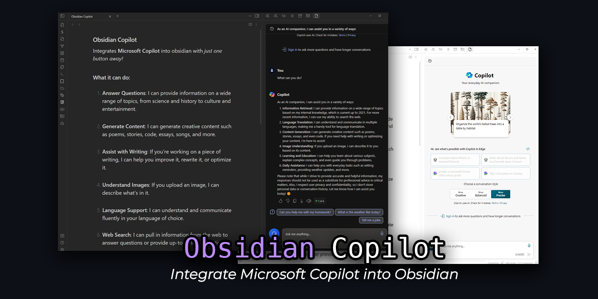

Is it me or all the AI plugins on Obsidian require you to be in a region where GPT works? And you **need** an API Key? Try Obsidian Copilot -- A simple obsidian extension that just works out of the box. No setup, No region restrictions, and best of all GPT-4 and Dall-E is free to use. 

## Usage
Once enabled in Obsidian from the community plugins tab.

Click the robot icon    in the left sidebar to open the Copilot panel.

Select your conversation style

Type your prompt and press `Enter` to get a response.

For more details refer to [Microsoft Learn Page](https://learn.microsoft.com/en-us/microsoft-365-copilot/microsoft-365-copilot-overview)

## Installation  
1. Open Obsidian and go to `Settings` -> `Community plugins` -> `Browse` and search for `Obsidian Copilot`. (**Pending approval**)

Alternatively,

1. Download the latest release from the [Releases](https://github.com/KTK27YT/Obsidian-Copilot/releases) page
2. go to your vault folder, and create a folder named `plugins` if it doesn't exist
3. Unzip the downloaded file into that directly
4. Enable community plugins in Obsidian and enable `Obsidian Copilot` from the list of Installed plugins

## Development 
1. Clone the repository
2. Run `npm install` to install the dependencies
3. Run `npm run dev` to start the development environment

## Contributing :sparkles:

As I am a novice developer, I appreciate any help I can get. If you want to contribute here is how to do it. Thank you!

1. Fork it (https://github.com/KTK27YT/Obsidian-Copilot/fork)
2. Create your feature branch (`git checkout -b feature/CoolNewFeature`)
3. Commit your changes (`git commit -am 'Add some CoolNewFeature'`)
4. Push to the branch (`git push origin feature/CoolNewFeature`)
5. Create a new Pull Request

## Support :star2:
if you would like to support this plugin, just give it a star on [Github](https://github.com/KTK27YT/Obsidian-Copilot). It would mean a lot to me.

## Thank you :raised_hands:
Thank you [Florian Ludewig](https://github.com/flolu/obsidian-plugin) for creating a youtube video teaching how to create a simple obsidian plugin. It was a great help to get started.

Thanks to [Copilot sidebar for Chrome](https://chromewebstore.google.com/detail/copilot-sidebar-for-chrom/ncjedehfkpnliaafimjhdjjeggmfmlgf) extension for being the massive source of inspiration for this plugin. 